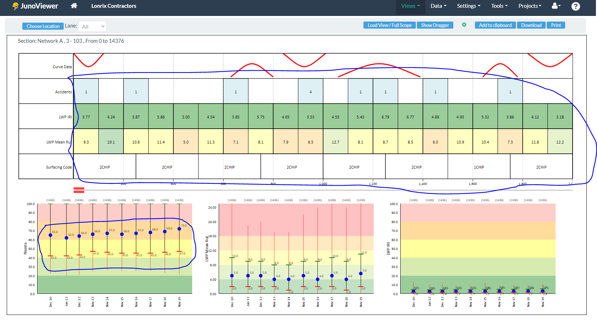

# README #

### About the repository ###
* This repository contains UI test automation R&D work for LONRIX website.

### Scope of test scripts ###
* JunoViewer > Views > Strip Map View > SVG handling at UI level. There is no implementation to handle business logics/rules.

### Prerequisite ###
* Java (Java 8 or Plus) installed
* JAVA_HOME environment variable configured
* Java IDE installed (IntelliJ IDEA or Eclipse)
* TestNG plugin installed in IDE
* Google Chrome web browser installed

### Technologies used ###
* Java
* TestNG
* Selenium WebDriver
* Web Driver Manager

### How do I get set up ###
* Download the repository into system.
* Unzip the repository

### How to execute tests ###
* Project is not compatible to run through command-line.
* So, import (maven import) project in Java EDI. 
* Then Run 'CvgHandling' class, which is available under package 'src.test.java.com.lonrix.junoviewerweb'.

### Coverage ###
* Till 2020/10/23

### Who do I talk to ###
* For more information contact: Jaspal Aujla at [jsaujla1@gmail.com](mailto:jsaujla1@gmail.com)